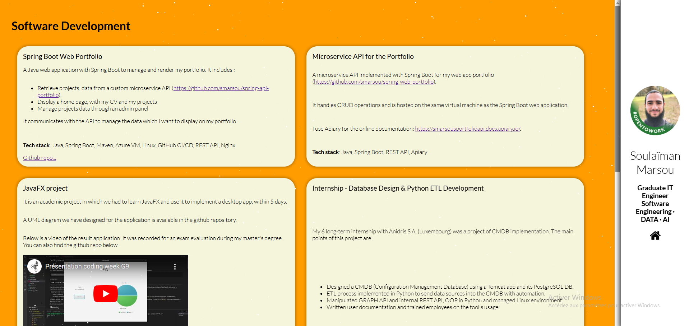
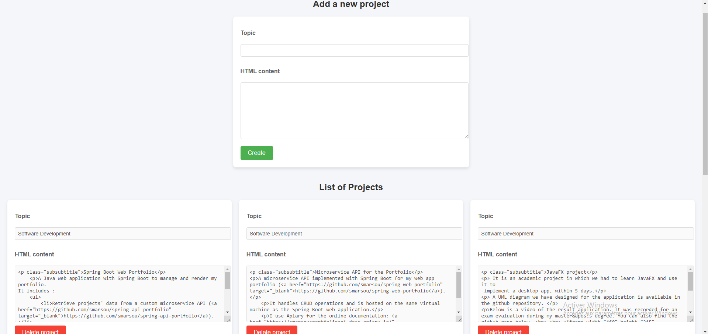

# Spring Boot Web Portfolio

A Java web application with Spring Boot to manage and render my portfolio.
It includes :
- retrieve projects' data from a custom microservice API (https://github.com/smarsou/spring-api-portfolio).
- display a home page, with my CV and my projects
- manage projects data through an admin panel

It communicates with the API to manage the data which I want to display on my portfolio.

**Tech stack** : Java, Spring Boot, Maven, Azure VM, Linux, Github CI/CD, REST API, Nginx

## The Web App
Accessible at http://smarsou.fr
### Home page (/)

### Admin panel (/admin)

### News

- Succesfully implemented a micro-service REST API with CRUD operations to manage the data about all my experience and project which I want to display in my portfolio. 
- Succesfully implemented an admin panel which allows to dynamically add new experience or delete older ones (by using the previous microservice API).
- Simple authentication system implemented for the admin panel (could be more secure by giving the hashed password throught an external source).
- Added Let's Encrypt certificate on the linux server for HTTPS

### Roadmap

- Implement tests
- Add the modify feature in the admin panel (only add and delete is implemented).

## Hosting the web app

For hosting the web app, I setup a Ubuntu virtual machine using Microsoft Azure Portal.

In this virtual machine:
- Firewalls rules to open port 80/tcp and 443/tcp are setup
- Java 17 jre is installed
- Nginx is configured as a reverse proxy with an ssl certificate from Let's Encrypt.
- A systemd service is configured to start and stop this web app
- The microservice REST API from the repository 'smarsou/spring-api-portfolio' is deployed in a docker container.
- A github runner is setup to deploy the web app continuously after any push on the main branch of this repository.
- A github runner is setup to deploy the microservice REST API continuously after any push on the main branch of the corresponding repository.
- A systemd service is configured to manage the github runners which run the jobs of the continous deployment.

## CI/CD

For the Continuous Deployment, the github runner on the ubuntu server does the job.
You can see the configuration of the pipeline in .github/workflows/maven-publish.yml.

A job is triggered every time a push is made on the main branch.

To show you different approach of deploying apps, I chose to deploy this application in the server directly and manage it throught a systemd service. This is a straihtforward and simple way to deploy application.
For a more consistent and popular way of deploy apps, you can check how I deployed the REST API using docker (http://github.com/smarsou/spring-api-portfolio)

The github workflow job does the following for this repository :
- stop the old SPRING BOOT web app and clean the repository in which we have the Jar file.
- import the current repository
- execute the packaging of the Spring app in a jar file.
- start the new jar (by starting the systemd service)

